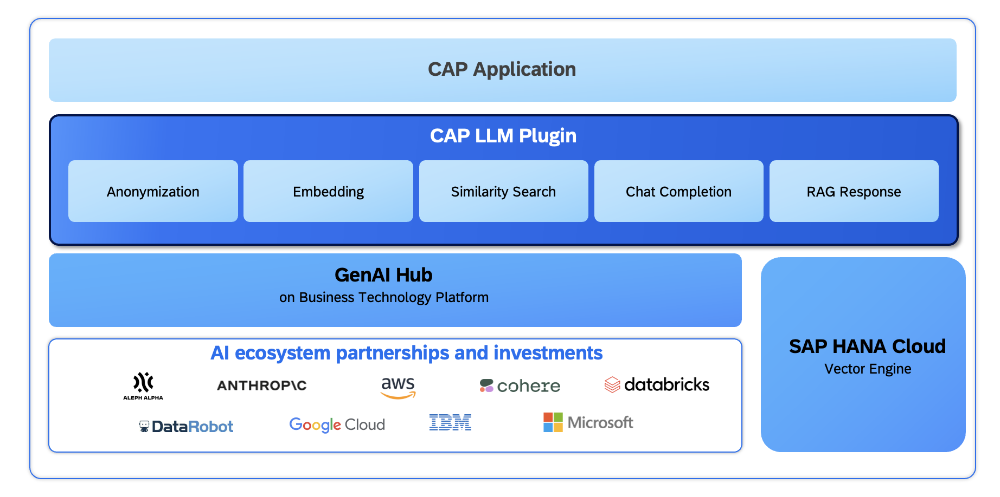

# CAP LLM Plugin

CAP LLM Plugin helps developers create tailored Generative AI based CAP applications:

1. Without exposing confidential data to LLM by anonymizing sensitive data leveraging SAP HANA Cloud Data Anonymization.
2. Seamlessly generate vector embeddings via SAP AI Core.
3. Easily retrieve Chat Completion response via SAP AI Core.
4. Effortlessly perform similarity search via SAP HANA Cloud Vector engine.
5. Simplified single RAG (retrieval-augmented generation) retrieval method powered by SAP AI Core and SAP HANA Cloud Vector Engine.

## Architecture 

## ✔️ Anonymization Features

|                         **Feature**                                                           |                                                           **Details**    
| :-------------------------------------------------------------------------------------------: | :------------------------------------------------------------------------------------------------------------------------------------
|  Seamlessly anonymize sensitive data using a variety of SAP HANA Cloud's anonymization capabilities |   Effortlessly anonymize sensitive data within a CAP application by employing a single `@anonymize` annotation using a diverse range of SAP HANA Cloud's anonymization algorithms, including but not limited to: <li> [k-Anonymity](https://help.sap.com/docs/SAP_HANA_PLATFORM/f88e51df089949b2af06ac891c77abf8/205f52e73c4a422e91fb9a0fbd5f3ec6.html)</li><li> [l-Diversity](https://help.sap.com/docs/SAP_HANA_PLATFORM/f88e51df089949b2af06ac891c77abf8/eeb681e53a06434ca8a0fd20ab9c2b7c.html)</li><li> [Differential Privacy](https://help.sap.com/docs/SAP_HANA_PLATFORM/f88e51df089949b2af06ac891c77abf8/ace3f36bad754cc9bbfe2bf473fccf2f.html)</li></ul>|
| Effortlessly replace the anonymized data within the LLM response with  genuine information|  Given that the data provided to the LLM consists of anonymized information, the CAP LLM plugin ensures a seamless replacement of anonymized content within the LLM response with the corresponding authentic data.    

## 🎯 LLM Access Layer Features

|                         **Feature**                                                           |                                                           **Details**    
| :-------------------------------------------------------------------------------------------: | :------------------------------------------------------------------------------------------------------------------------------------
|  Embedding generation via SAP AI Core | Easily connect to embedding models via SAP AI Core and generate embeddings seamlessly |
|  Similarity search  |  Leverage the SAP HANA Cloud's Vector engine to perform similarity search via CAP LLM Plugin |  
|  Chat LLM Access via SAP AI Core |   Simple access to LLM models via SAP AI Core with simplified method for chat completion |  
|  Streamlining RAG retrieval  |   Single method to streamline the entire RAG retrieval process leveraging SAP AI Core and SAP HANA Cloud Vector Engine |

## 📚 Samples and documentation

For API documentation for the CAP LLM plugin, refer the [api-documentation](./docs/api-documentation.md).

For how to use Anonymization with CAP LLM plugin, refer the [anonymization-usage](./docs/anonymization-usage.md).

For sample use cases leveraging CAP LLM Plugin, refer to [Samples](./samples/).

## How to obtain support
[Create an issue](https://github.com/SAP-samples/cap-llm-plugin-samples/issues) in this repository if you find a bug from the plugin.
 
For other support, [ask a question in SAP Community](https://answers.sap.com/questions/ask.html).

## License
Copyright (c) 2024 SAP SE or an SAP affiliate company. All rights reserved. This project is licensed under the Apache Software License, version 2.0 except as noted otherwise in the [LICENSE](LICENSE) file.
