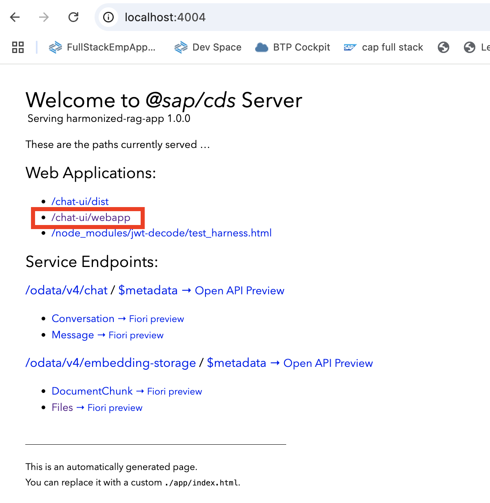
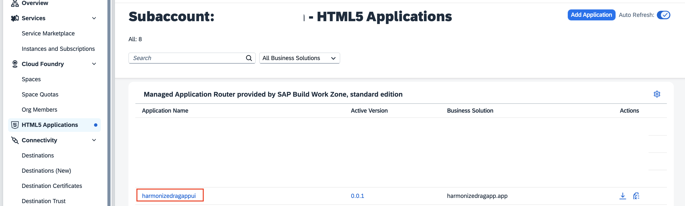
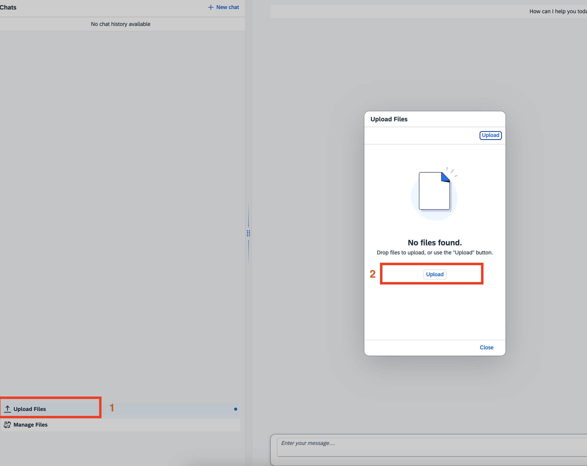
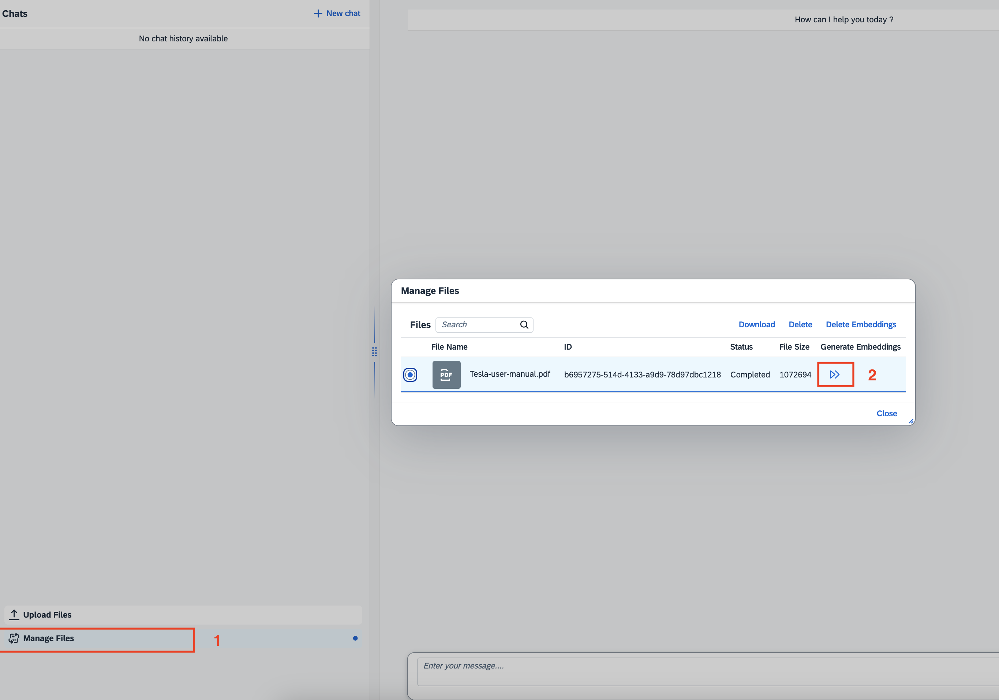
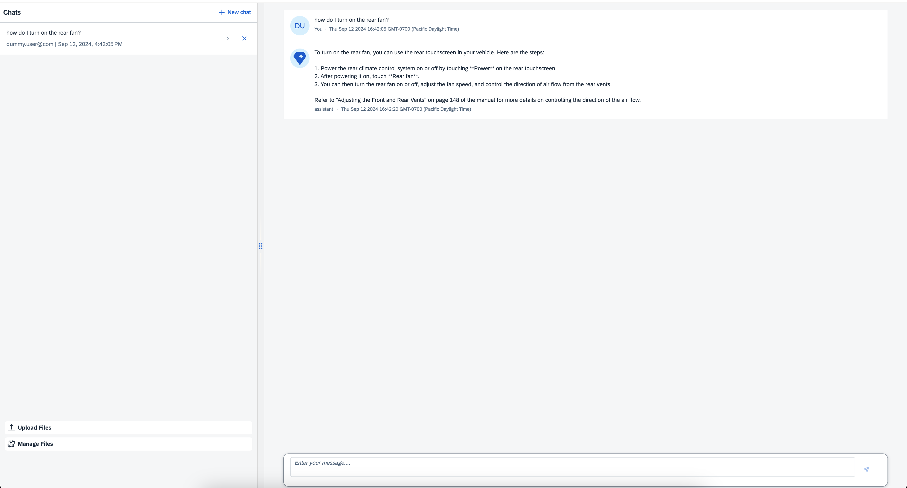

# Harmonized RAG Quickstart CAP Application using CAP LLM Plugin's harmonized chat completion powered by SAP AI Core's orchestration service.

This quickstart sample CAP application showcases a RAG scenario where the user can upload and interact with the document in a low-code setting. The application leverages the CAP LLM Plugin to seamlessly tap into the vector engine capabilities of HANA Cloud and access the LLM capabilities offered by SAP AI Core's orchestration service to implement this RAG scenario.


Note: For any issues, please feel free to raise a new issue in the "Issues" section of the current github repo.

### Pre-requisites:

## Embedding model and SAP HANA Cloud setup:
 
1. <a href="https://help.sap.com/docs/sap-ai-core/sap-ai-core-service-guide/create-service-instance" target="_blank">Create SAP AI Core service instance</a> and make sure to choose the service plan extended to activate Generative AI Hub and continue [creating a Service Key](https://help.sap.com/docs/sap-ai-core/sap-ai-core-service-guide/create-service-key). Take a note of the service key credentials.
 
2. Create model deployments for the Embedding models in Generative AI Hub via <a href="https://help.sap.com/docs/sap-ai-core/sap-ai-core-service-guide/create-deployment-for-generative-ai-model-in-sap-ai-core" target="_blank">api</a>
 or <a href="https://developers.sap.com/tutorials/ai-core-generative-ai.html#7a5bec43-f286-4004-9b0b-6359199141da" target="_blank">ai-launchpad</a> and take a note of the following parameters once the deployment is completed.

```
deploymentUrl which looks like https://api.ai.prod.***************.ml.hana.ondemand.com/v2/inference/deployments/d71748b9823c5f21 where d71748b9823c5f21 is the deploymentID.
modelName like text-embedding-ada-002
resourceGroupId (you generally set this while creating the ai core instance) like default
```

3.  <a href="https://help.sap.com/docs/HANA_SERVICE_CF/cc53ad464a57404b8d453bbadbc81ceb/21418824b23a401aa116d9ad42dd5ba6.html" target="_blank">Create SAP HANA Cloud service instance</a> with Vector Engine (QRC 1/2024 or later) in your BTP space.

4. Create the destination within the destination service instance in the BTP space:

- For Hybrid testing, you will have to [create a destination service instance - instructions found in step 3 of hybrid testing section](#hybrid-testing) and create the below destination within the destination service in your BTP space.
- For BTP deployment, the destination service will be created for you in the BTP space, you will have to create the below destination within the created destination service instance with the name `harmonized-rag-app-destination-service`.

Navigate to the space in the BTP cockpit, click on the destination service instance `harmonized-rag-app-destination-service` in the instances section. Click on 'Manage Instance button'. In the 'Destinations' section, click on 'Create Destination' and create the destination with the following parameters:
 
```
Name: aicore-destination
Description: SAP AI Core deployed service (generative AI hub)
URL: <AI-API-INSIDE-AI-CORE-SERVICE-KEY>
Type: HTTP
ProxyType: Internet
Authentication: OAuth2ClientCredentials
tokenServiceURL: <TOKEN-SERVICE-URL-OF-AI-CORE-SERVICE-KEY>/oauth/token
clientId: <YOUR-CLIENT-ID-OF-AI-CORE-SERVICE-KEY>
clientSecret: <YOUR-CLIENT-SECRET-OF-AI-CORE-SERVICE-KEY>
# Additional Properties:
URL.headers.AI-Resource-Group: default # adjust if necessary
URL.headers.Content-Type: application/json
HTML5.DynamicDestination: true

```
Check the `Use default jdk store` button while creating the destination.

5. Configure the Generative AI Hub model configuration in your CAP application:
 
For example, in `package.json` file in your CAP application, configure the destination and model configurations as follows: 
 
```
    "cds": {
        "requires": {
            "gen-ai-hub": {
                  "text-embedding-ada-002": {
                    "destinationName": "GenAIHubDestination",
                    "deploymentUrl": "/v2/inference/deployments/<deploymentID from the deploymentUrl from step 2 like d71748b9823c5f21>",
                    "resourceGroup": ""<resourcegroupId from step 2 like default>"",
                    "apiVersion": "2024-02-15-preview",
                    "modelName": "<modelName from step 2 like text-embedding-ada-002>"
                  }
                },
            "GenAIHubDestination": {
                "kind": "rest",
                "credentials": {
                  "destination": "aicore-destination",
                  "requestTimeout": "300000"
                }
              }
 
```

Refer the [documentation](https://help.sap.com/docs/sap-ai-core/sap-ai-core-service-guide/create-deployment-for-generative-ai-model-in-sap-ai-core) for more details.

## Plugin's SAP AI Core's orchestration service setup:

1. Before using these methods, ensure you meet the [prerequisites](https://www.npmjs.com/package/@sap-ai-sdk/orchestration#prerequisites).

2. Bind the SAP AI Core service instance to your CAP application as follows:
  
  - For hybrid testing, run the following command:
  ```   
    cf create-service-key <ai-core-service-instance-name> SharedDevKey   
    cds bind -2 <ai-core-service-instance-name>:SharedDevKey   
  ```   
  - For BTP deployment, change the SAP AI Core service instance name in mta.yaml:  
  ```  
    - name: aicoretestextend
# ------------------------------------------------------------
    type: org.cloudfoundry.managed-service
    parameters:
      service: aicore
      service-name: <ai-core-service-instance-name>
      service-plan: extended
  ```  

## Getting started

1.  Clone this repo. 
2.  Navigate to the `harmonized-rag-app` folder under `samples` folder.    
2.  Connect to subaccount using cf:      
    ` cf api <subaccount-endpoint>`    
    ` cf login`   

3. Install node modules using `npm install --save`

Note: 

- If you get any permission issues while running any of the commands, run it with `sudo`.
- If you get an error with @sap/cds-dk, install it as  following:
  `npm install -g @sap/cds-dk`

## Hybrid testing

1. Configure the UI to work for hybrid testing:

  In the `app/chat-ui/webapp/controller/App.controller.js`, do the following change:

  ```
  sessionStorage.setItem("isDeployedVersion", "false");
  ```
  
2. Create HDI container (HANA service instance) and bind it to the CAP pplication as follows:   
    Note: Please wait for the service instance and service key creation to complete before you run the next command (which generally takes sometime).   

    `cf create-service hana hdi-shared harmonized-rag-db`    
    `cf create-service-key harmonized-rag-db  SharedDevKey`   
    `cds bind -2  harmonized-rag-db:SharedDevKey`  

3. Create and bind the destination service to the CAP application as follows (which you would have done in the pre-requisites section):  
     Note: Please wait for the service instance and service key creation to complete before you run the next command (which generally takes sometime).      
    `cf create-service destination lite harmonized-rag-app-destination-service`  
    `cf create-service-key harmonized-rag-app-destination-service SharedDevKey`  
    `cds bind -2  harmonized-rag-app-destination-service:SharedDevKey`  

4. Build the artifacts and deploy to SAP HANA Cloud:

    `cds build --production`  
    `cds deploy --to hana:harmonized-rag-db`  

- Build server and run application:
`cds watch --profile hybrid`

Note: For hydrid testing, login to the UI by clicking on the below link:



Use the following credentials to login:

```
user: dummy.user@com
password: initial
```

## Deploy on SAP BTP:

1. Configure the UI to work in BTP:

  In the `app/chat-ui/webapp/controller/App.controller.js`, do the following change:

  ```
  sessionStorage.setItem("isDeployedVersion", "true");
  ```
2. Run npm install as follows:

```
npm install --save
```

3. Run the following command to deploy server:

```
cds build --production
```   

4. Build and deploy mtar

```
mbt build
cf deploy mta_archives/<mtar_filename>
```   


Note: After deployment, please ensure you complete step 2 of the pre-requisite section, particularly the step for creating the destination in the created destination service `harmonized-rag-app-destination-service`, if not already present.

Note: To access the UI of the deployed BTP app, navigate to the subaccount and click on the HTML5 applications and select "harmonizedragappui".




## How to use the application:

- Upload policy document in pdf format in the UI.  Here is a sample [tesla user manual](https://www.tesla.com/ownersmanual/model3/en_us/Owners_Manual.pdf) that you can upload.   
Note:
  - Currently just pdf unencrypted documents are supported. You can enhance the application to support additional documents as well.
  - Please ensure the filename does not have any spaces.




- Generate the vector embeddings for the document by clicking on the below button:



- Use the chat based UI for interacting with the documents.




  


