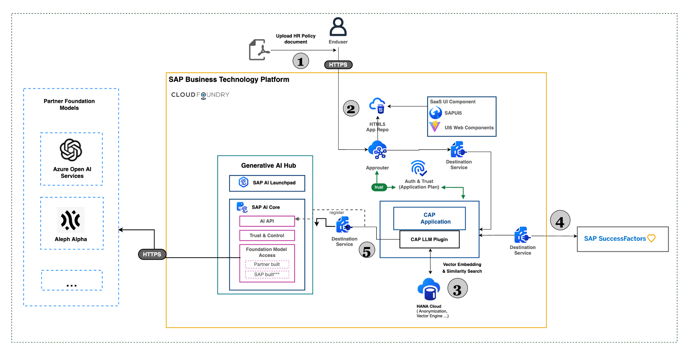

# HR Policy Chat Assistant

This sample CAP application uses the CAP LLM Plugin to simplify the process of accessing HANA Vector/Embedding features, connectivity to AI Core and automate the entire RAG retrieval flow. It demonstrates a RAG scenario where users can ask any questions regarding leave requests, other HR policy and the application leverages RAG architecture to combine HR Policy documents with the leave data residing in SAP SuccessFactors systems to provide appropriate response.



### Pre-requisites:
 
1. [Create an instance of SAP AI Core](https://help.sap.com/docs/sap-ai-core/sap-ai-core-service-guide/create-service-instance) and make sure to choose the service plan extended to activate Generative AI Hub and continue creating a Service Key.
 
2. [Create deployments](https://help.sap.com/docs/sap-ai-core/sap-ai-core-service-guide/create-deployment-for-generative-ai-model-in-sap-ai-core) for a model support ChatCompletion (e.g, gpt-35-turbo or gpt-4) and an embedding model (text-embedding-ada-002) and note down the Deployment IDs for each. All available models are listed here.
 
3. [Create a Destination](https://help.sap.com/docs/btp/sap-business-technology-platform/create-destination) for Generative AI Hub in the SAP BTP Cockpit of your subaccount based on the Service Key of SAP AI Core you created in the previous step:
 
```
Name: GENERATIVE_AI_HUB
Description: SAP AI Core deployed service (generative AI hub)
URL: <AI-API-OF-AI-CORE-SERVICE-KEY>/v2 # make sure to add /v2!
Type: HTTP
ProxyType: Internet
Authentication: OAuth2ClientCredentials
tokenServiceURL: <TOKEN-SERVICE-URL-OF-AI-CORE-SERVICE-KEY>/oauth/token
clientId: <YOUR-CLIENT-ID-OF-AI-CORE-SERVICE-KEY>
clientSecret: <YOUR-CLIENT-SECRET-OF-AI-CORE-SERVICE-KEY>
# Additional Properties:
URL.headers.AI-Resource-Group: default # adjust if necessary
URL.headers.Content-Type: application/json
HTML5.DynamicDestination: true
```
 
4. [Create SAP HANA Cloud](https://help.sap.com/docs/HANA_CLOUD_ALIBABA_CLOUD/683a53aec4fc408783bbb2dd8e47afeb/7d4071a49c204dfc9e542c5e47b53156.html) with Vector Engine (QRC 1/2024 or later).

 
5. Configure the Generative AI Hub and SuccessFactors connection details.

Refer [SuccessFactors authorization header details](https://help.sap.com/docs/SAP_SUCCESSFACTORS_PLATFORM/d599f15995d348a1b45ba5603e2aba9b/5c8bca0af1654b05a83193b2922dcee2.html).
 
For example, in `.cdsrc.json` file. Refer the [documentation](https://help.sap.com/docs/sap-ai-core/sap-ai-core-service-guide/create-deployment-for-generative-ai-model-in-sap-ai-core) for more details.
 
```
{
    "cdsc": {
        "beta": {
            "vectorType": true
        }
    },
    "requires":{
        "GENERATIVE_AI_HUB": {
            "CHAT_MODEL_DESTINATION_NAME": "AICoreAzureOpenAIDestination",
            "CHAT_MODEL_DEPLOYMENT_URL": "<CHAT_MODEL_DEPLOYMENT_URL> . For example: /v2/inference/deployments/<deployment-id>",
            "CHAT_MODEL_RESOURCE_GROUP": "<CHAT_MODEL_RESOURCE_GROUP>",
            "CHAT_MODEL_API_VERSION": "<CHAT_MODEL_API_VERSION>",
            "EMBEDDING_MODEL_DESTINATION_NAME": "AICoreAzureOpenAIDestination",
            "EMBEDDING_MODEL_DEPLOYMENT_URL": "<CHAT_MODEL_DEPLOYMENT_URL>. For example: /v2/inference/deployments/<deployment-id>",
            "EMBEDDING_MODEL_RESOURCE_GROUP": "default",
            "EMBEDDING_MODEL_API_VERSION": "<EMBEDDING_MODEL_API_VERSION>"
        },
        "AICoreAzureOpenAIDestination": {
            "kind": "rest",
            "credentials": {
              "destination": "<destination-name-created-in-step-3>",
              "requestTimeout": "300000"
            }
        },
        "SUCCESS_FACTORS_CREDENTIALS": {
            "AUTHORIZATION_HEADER": "<AUTHORIZATION_HEADER>",
            "USER_ID": "<USER_ID>"
        }
    }
 
}
 
```

## Getting started

-   Clone this repo.      
-   Connect to subaccount with HANA Cloud instance and authenticate to cf:      
` cf api <subaccount-endpoint>`    
` cf login`   

- Install node modules using `npm i`

## Hybrid testing

- Bind the following services to application:
    - hana cloud
    - destination service

- Build artifacts and deploy to HANA:

`cds build --production`  
`cds deploy --to hana:<hana-service-instance>`  

- Build server and run application:

`cds build`  
`cds watch --profile dev`

## Deploy on SAP BTP:

- Run the following command to deploy server:

`cds build --production`

- Build and deploy mtar

```
mbt build
cf deploy mta_archives/<mtar_filename>
```

## How to use the application:

- Upload policy document and generate embeddings from UI.
- Use the chat based UI for retrieving answers to the question.