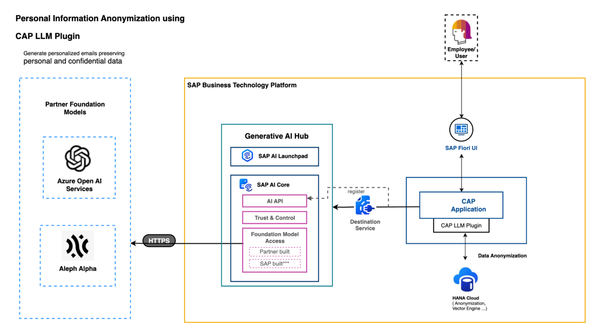

# Employee Personalized Email Use Case using CAP LLM Plugin

Consider a CAP application where personalized emails need to be generated to congratulate employees on their contributions to the company. This process involves feeding sensitive employee information to the LLM to generate personalized employee emails. However, we want to ensure that the confidentiality of this sensitive information is preserved while retaining sufficient business context. In this scenario, the CAP LLM Plugin can be used to seamlessly anonymize the sensitive employee data by applying SAP HANA Cloud data anonymization techniques. 

## Pre-requisites

-   Ensure that cloud foundry is enabled in the subaccount [guide](https://help.sap.com/docs/DIGITALPAYMENTS/a5c364402f8d4c0b99f6a4c7de385a56/223db7192df44425b66bba122110779b.html).
-   Ensure that HANA service instance has been created [guide](https://help.sap.com/docs/HANA_SERVICE_CF/cc53ad464a57404b8d453bbadbc81ceb/21418824b23a401aa116d9ad42dd5ba6.html) and the entitlements for 'SAP HANA Schemas and HDI Containers' have been added in the subaccount [guide](https://help.sap.com/docs/btp/sap-business-technology-platform/configure-entitlements-and-quotas-for-subaccounts).
-   Ensure you have an instance of SAP Generative AI Hub using this [guide](https://github.com/SAP-samples/btp-cap-genai-rag/blob/main/docs/tutorial/2-setup/4-generativeAIhub.md#setup-the-generative-ai-hub-in-sap-ai-core).

## Folder structure

It contains these folders and files, following our recommended project layout:

File or Folder | Purpose
---------|----------
`app/` | content for UI frontends goes here
`db/` | your domain models and data go here
`srv/` | your service models and code go here
`package.json` | project metadata and configuration
`readme.md` | this getting started guide

## Getting started

-   Clone this repo.      
-   Connect to subaccount with HANA Cloud instance and authenticate to cf:      
` cf api <subaccount-endpoint>`    
` cf login`    
-   Create a destination service and add the destination to the destination service:  
`cf create-service destination lite employee-anyz-usecase-destination-service`      

    Add the destination created in the pre-requisite [step](https://github.com/SAP-samples/btp-cap-genai-rag/blob/main/docs/tutorial/2-setup/4-generativeAIhub.md#create-destination) to the destination service in the BTP Cockpit space by referring to the [guide](https://help.sap.com/docs/connectivity/sap-btp-connectivity-cf/destinations-pointing-to-service-instances).   

- Replace the placeholders in the `srv/ai-core-service.js` with appropriate values. Ensure that the "AI_CORE_DESTINATION_NAME" configured in package.json file matches the one configured in `srv/ai-core-service.js` file.

For running it locally perform the following steps:

-  Create HDI container (HANA service instance) and bind it to the CAP pplication as follows:  
`cf create-service hana hdi-shared emp-anz-proj-db`    
`cf create-service-key emp-anz-proj-db  SharedDevKey`   
`cds bind -2  emp-anz-proj-db:SharedDevKey`  

-  Bind the previously created desination service to the CAP application as follows:  
`cf create-service-key employee-anyz-usecase-destination-service SharedDevKey`  
`cds bind -2  employee-anyz-usecase-destination-service:SharedDevKey`  

-  cds build  
`cds build`  

-  Deploy the db artifacts  
`cds deploy --to hana:emp-anz-proj-db`  

-  Start the app locally  
`cds watch --profile hybrid`  

Deploy the application to BTP as follows:

-  Build the mtar file using the following command:      
`mbt build -t ./`  

- Deploy the mtar to BTP using the following command:  
`cf deploy <mtar-file>`  

